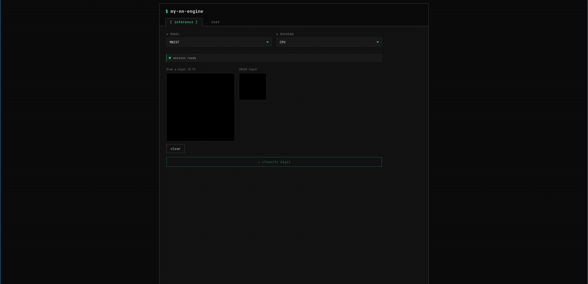
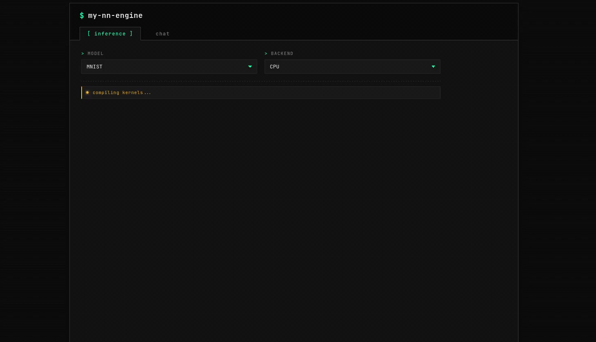

# my-nn-engine

Hobby ONNX compiler and inference engine in Rust. Lowers an ONNX graph
to LLVM IR for CPU and to generated CUDA C++ for GPU, then runs it as
one compiled artifact.

## Demo

### MNIST



### LLM



## Highlights

- Compile ONNX -> LLVM IR (CPU) or generated CUDA C++ -> nvcc -> shared library; the whole graph becomes a single compiled function per device.
- Graph optimization, memory planning, and stream scheduling share a single pipeline, so allocation reuse and stream assignment can be informed by fusion and op-level layout decisions.
- CPU and CUDA backends in one tree.

## Quickstart

```sh
git clone https://github.com/kcvlex/my-nn-engine
cd my-nn-engine

# Build with CPU + CUDA backends (default features).
cargo build --release

# Pull the validated model tarballs.
make -C models/validated

# Run ResNet-18 on CPU.
cargo run --release --example run_model cpu
``
```

## Validated models

| model | source |
|-|-|
| `resnet18-v2-7`, `resnet152-v2-7` | <https://github.com/onnx/models/tree/bec48b6a70e5e9042c0badbaafefe4454e072d08/validated/vision/classification/resnet> |
| `mobilenetv2-12` | <https://github.com/onnx/models/tree/bec48b6a70e5e9042c0badbaafefe4454e072d08/validated/vision/classification/mobilenet> |
| `efficientnet-lite4-11` | <https://github.com/onnx/models/tree/bec48b6a70e5e9042c0badbaafefe4454e072d08/validated/vision/classification/efficientnet-lite4> |
| `yolov4` | <https://github.com/onnx/models/tree/bec48b6a70e5e9042c0badbaafefe4454e072d08/validated/vision/object_detection_segmentation/yolov4> |
| `bertsquad-12` | <https://github.com/onnx/models/tree/bec48b6a70e5e9042c0badbaafefe4454e072d08/validated/text/machine_comprehension/bert-squad> |
| `mnist-12` | <https://github.com/onnx/models/tree/bec48b6a70e5e9042c0badbaafefe4454e072d08/validated/vision/classification/mnist> |
| `GPT2` | <https://github.com/onnx/models/tree/bec48b6a70e5e9042c0badbaafefe4454e072d08/validated/text/machine_comprehension/gpt-2> |

## Repository layout

Cargo workspace; the root crate is the engine, the sub-crates are applications and dev tools that build on top of it.

| path | crate | role |
|-|-|-|
| `.` | `my-nn-engine` | ONNX compiler and runtime; CPU + CUDA backends. |
| `crates/llm` | `my-nn-engine-llm` | LLM runtime built on the engine. See [`crates/llm/README.md`](crates/llm/README.md). |
| `crates/bench-llm` | `my-nn-bench-llm` | LLM bench harness vs llama.cpp / ORT-GenAI. See [`crates/bench-llm/README.md`](crates/bench-llm/README.md). |
| `crates/test-tools` | `my-nn-engine-test-tools` | Subgraph extraction + binary-search debugger via Podman. See [`crates/test-tools/README.md`](crates/test-tools/README.md). |
| `crates/ui` | `my-nn-engine-ui` | gRPC backend + Vue chat frontend (uses the LLM crate). See [`crates/ui/README.md`](crates/ui/README.md). |


## Testing and profiling

```sh
# Save LLVM IR and transformed ONNX to the build dir printed in the log.
MY_ONNX_SAVE_BUILD_DIR=1 RUST_LOG=info cargo test-cpu

# Nsight Systems profiling: <model_dir> [num_runs] [num_streams].
cargo build --release --bin profile
nsys profile target/release/profile models/validated/resnet18-v2-7 5 2
```

## License

CC0 1.0. See [LICENSE](LICENSE).
